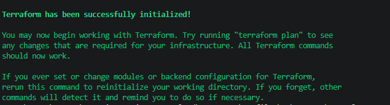

# Terraform AWS VPC Foundation

A Terraform-based Infrastructure as Code (IaC) project that provisions a foundational AWS networking environment including a Virtual Private Cloud (VPC), public and private subnets, route tables, and an Internet Gateway.

This project was developed to demonstrate Terraform fundamentals, AWS networking concepts, Infrastructure as Code practices, and cloud architecture principles commonly used in Platform Engineering, Cloud Engineering, and Solutions Architecture environments.

---

## Project Objectives

This project demonstrates:

* Infrastructure as Code (IaC)
* Terraform fundamentals
* AWS networking design
* Reusable infrastructure patterns
* Cloud architecture best practices
* Platform Engineering concepts

---

## Architecture Overview

The solution provisions the following AWS networking components:

```text
AWS Region
    │
    ▼
VPC (10.0.0.0/16)
    │
    ├── Public Subnet (10.0.0.0/24)
    │       │
    │       ▼
    │   Internet Gateway
    │
    └── Private Subnet (10.0.1.0/24)
```

---

## Resources Created

### Networking

* AWS VPC
* Internet Gateway
* Public Subnet
* Private Subnet
* Public Route Table
* Private Route Table
* Route Table Associations

### Terraform Components

* Providers
* Variables
* Outputs
* Reusable configuration

---

## Technology Stack

| Component              | Technology                 |
| ---------------------- | -------------------------- |
| Infrastructure as Code | Terraform                  |
| Cloud Platform         | AWS                        |
| Networking             | VPC, Subnets, Route Tables |
| Version Control        | Git                        |
| Repository Hosting     | GitHub                     |

---

## Project Structure

```text
terraform-aws-vpc-foundation/
│
├── images/
│   └── terraform-init-success.png
│
├── vpc/
│   ├── main.tf
│   ├── providers.tf
│   ├── variables.tf
│   ├── outputs.tf
│   ├── terraform.tfvars.example
│   ├── .gitignore
│   └── .terraform.lock.hcl
│
├── LICENSE
└── README.md
```

---

## Current Progress

### Completed

1. Terraform project structure created

2. AWS provider configuration completed

3. Variable definitions created

4. VPC configuration completed

5. Public subnet configuration completed

6. Private subnet configuration completed

7. Internet Gateway configuration completed

8. Route table configuration completed

9. Terraform initialization completed

### Pending

* Terraform validation

* Terraform plan generation

* AWS deployment

* Infrastructure verification

* Terraform destroy testing

---

## Terraform Workflow

### Initialise Terraform

```bash
terraform init
```

Downloads the required Terraform providers and prepares the working directory.

### Format Configuration

```bash
terraform fmt
```

Applies standard Terraform formatting.

### Validate Configuration

```bash
terraform validate
```

Validates Terraform syntax and configuration.

### Generate Deployment Plan

```bash
terraform plan
```

Produces a preview of the infrastructure changes Terraform would make.

### Deploy Infrastructure

```bash
terraform apply
```

Creates the AWS resources defined in the Terraform configuration.

### Destroy Infrastructure

```bash
terraform destroy
```

Removes all resources created by Terraform.

---

## Screenshots

### Terraform Initialization



---

## Skills Demonstrated

### Cloud Architecture

* AWS Networking
* VPC Design
* Public / Private Subnet Architecture
* Internet Connectivity Design

### Infrastructure as Code

* Terraform
* Variables
* Outputs
* Reusable Configuration

### Platform Engineering

* Infrastructure Automation
* Environment Provisioning
* Cloud Foundation Design

### DevOps

* Git Version Control
* Infrastructure Lifecycle Management
* Configuration Management

---

## CloudFormation vs Terraform

This project extends a previous AWS CloudFormation networking project by implementing the same foundational AWS networking architecture using Terraform.

### CloudFormation Components

* VPC
* Internet Gateway
* Public Subnet
* Private Subnet
* Route Tables
* Route Associations

### Terraform Equivalents

* aws_vpc
* aws_internet_gateway
* aws_subnet
* aws_route_table
* aws_route
* aws_route_table_association
* outputs

This demonstrates experience with multiple Infrastructure as Code technologies and cloud provisioning approaches.

---

## Deployment Notes

This project has been developed and validated locally using Terraform.

Deployment requires access to an AWS account with appropriate permissions. In environments where AWS credentials are not available, the project can still be validated using:

```bash
terraform fmt
terraform validate
```

Infrastructure changes can be reviewed using:

```bash
terraform plan
```

before deployment.

---

## Future Enhancements

* Multi-AZ deployment
* NAT Gateway
* Security Groups
* EC2 Bastion Host
* Terraform Modules
* Remote State Management (S3 + DynamoDB)
* GitHub Actions CI/CD
* AWS Transit Gateway integration
* VPC Peering
* Network ACLs

---

## Learning Outcomes

This project provided hands-on experience with:

* Terraform
* AWS Networking
* Infrastructure as Code
* Cloud Architecture
* Platform Engineering
* Infrastructure Lifecycle Management
* Reusable Infrastructure Design

---

## Author

**Shehan Warnakulasuriya**

Senior Systems Analyst Specialist
AWS Certified Solutions Architect – Associate
Cloud & Platform Engineering
Aspiring Solutions Architect
